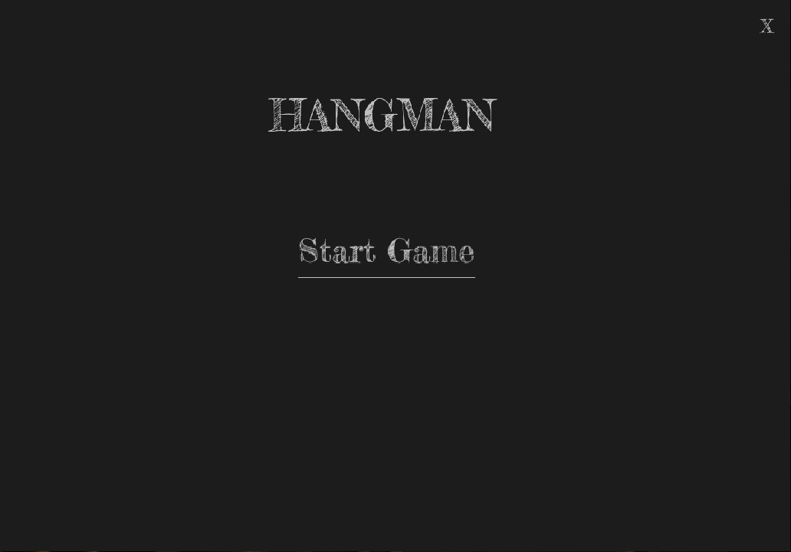

# Hangman Game with SDL2

A modern, graphical implementation of the classic Hangman game using SDL2 and C. Features multiple difficulty levels, two-player gameplay, and an intuitive user interface.



## Features

- 🎮 Graphical user interface using SDL2
- 👥 Two-player gameplay
- 🎯 Three difficulty levels:
  - Easy: 3-4 letter words (lowercase only)
  - Medium: 5-7 letter words (case-sensitive)
  - Hard: 8+ letter words (case-sensitive)
- 🎨 Visual hangman progression
- ⌨️ Real-time input validation
- 🔤 15 attempts to guess the word

## Prerequisites

Before you begin, ensure you have the following installed:

- SDL2
- SDL2_ttf
- SDL2_image
- C compiler (gcc recommended)

### Installing Dependencies

For Ubuntu/Debian:

```bash
sudo apt-get install libsdl2-dev libsdl2-ttf-dev libsdl2-image-dev
```

For Fedora:

```bash
sudo dnf install SDL2-devel SDL2_ttf-devel SDL2_image-devel
```

For macOS (using Homebrew):

```bash
brew install sdl2 sdl2_ttf sdl2_image
```

## Compilation

To compile the game, use the following command:

```bash
gcc -o hangman main.c -lSDL2 -lSDL2_ttf -lSDL2_image
```

## How to Play

1. Launch the game
2. Player 1 enters their name
3. Player 2 enters their name
4. Select difficulty level
5. Player 1 enters a word
6. Player 2 attempts to guess the word one letter at a time


<!-- Add your own screenshot by saving it in assets/screenshots/ folder -->

## Controls

- Left Mouse Click: Select options
- ESC: Return to menu
- Enter: Confirm selections
- Letters: Input guesses during gameplay
- Y/N: Play again/quit after game ends

## Project Structure

```hangman/
    ├── main.c
    ├── assets/
    │   ├── hangman_0.png
    │   ├── hangman_1.png
    │   └── ...
    ├── fonts/
    │   └── Fredericka_the_Great_Regular.21.ttf
    └── README.md
```

## Known Issues

- Font path is currently hardcoded
- Requires specific font installation
